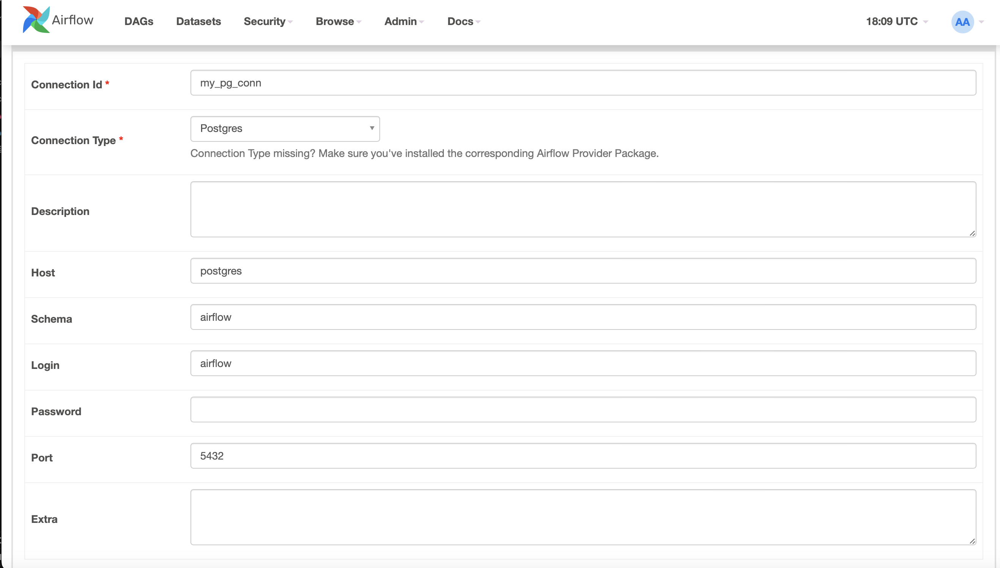

Airflow

## Fetch docker-compose.yaml
ทำการ Fetch docker-compose ไว้ใน folder ที่ต้องการ
```bash
curl -LfO 'https://airflow.apache.org/docs/apache-airflow/2.9.2/docker-compose.yaml'
```
[**Ref:** https://airflow.apache.org/docs/apache-airflow/stable/howto/docker-compose/index.html](https://airflow.apache.org/docs/apache-airflow/stable/howto/docker-compose/index.html)

ทำการสร้าง folder หรือ ใช้คำสั่ง
```bash
mkdir dags/ logs/ plugins/ 
```


## Dockerfile & requirements
สร้าง Dockerfile ไว้สำหรับต้องการ install airflow version อื่นๆ หรือ import library เพิ่มเติม
```bash
FROM apache/airflow:2.4.1
ADD requirements.txt .
RUN pip install apache-airflow==${AIRFLOW_VERSION} -r requirements.txt
```


## Running with Docker Compose

```sh
docker compose up
or
docker compose up --build #สำหรับมี Dockerfile
 ```


## Postgresql connection
แก้ connection ใน airflow


